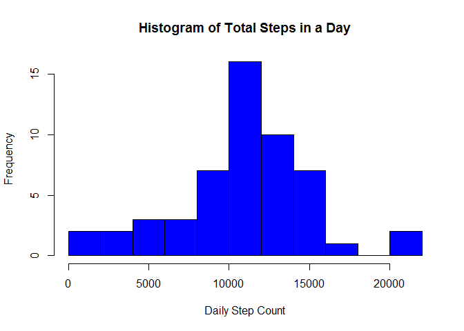
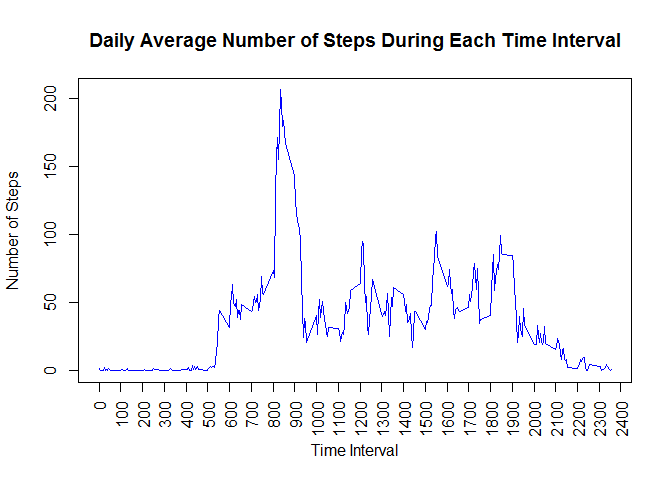
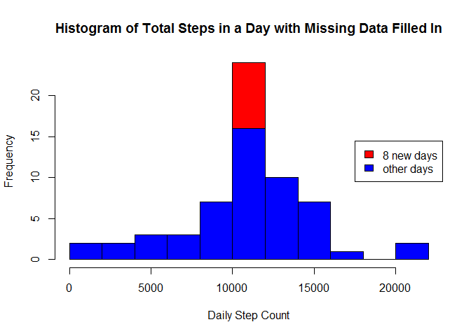
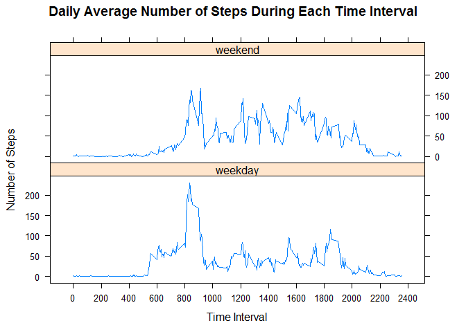

# Reproducible Research: Peer Assessment 1
Stacy Hoehn  
May 9, 2017  


## Loading and preprocessing the data

We will first load the data into R and format the columns as integers or dates, as appropriate.


```r
library(readr)
```

```
## Warning: package 'readr' was built under R version 3.3.3
```

```r
setwd("C:/Users/shoehn/RepData_PeerAssessment1")
stepData <- read_csv("activity.zip",
                    col_types = cols(date = col_date(format = "%Y-%m-%d"),
                    steps = col_integer()))
head(stepData)
```

```
## # A tibble: 6 × 3
##   steps       date interval
##   <int>     <date>    <int>
## 1    NA 2012-10-01        0
## 2    NA 2012-10-01        5
## 3    NA 2012-10-01       10
## 4    NA 2012-10-01       15
## 5    NA 2012-10-01       20
## 6    NA 2012-10-01       25
```

## What is mean total number of steps taken per day?

For this part of the assignment, we will ignore the missing values in the dataset. First, we will calculate the total number of steps taken per day.


```r
dailyTotals <- aggregate(steps ~ date, data = stepData, FUN = sum, na.rm = TRUE)
head(dailyTotals,8) #display the first 8 daily totals
```

```
##         date steps
## 1 2012-10-02   126
## 2 2012-10-03 11352
## 3 2012-10-04 12116
## 4 2012-10-05 13294
## 5 2012-10-06 15420
## 6 2012-10-07 11015
## 7 2012-10-09 12811
## 8 2012-10-10  9900
```

Next, we will make a histogram of the total number of steps taken each day.

```r
hist(dailyTotals$steps,breaks=10,main="Histogram of Total Steps in a Day",
     xlab="Daily Step Count",ylab="Frequency",col="blue")
```

<!-- -->

Finally, we will calculate the mean and median of the total number of steps taken per day.

```r
meanDailyTotal <- mean(dailyTotals$steps,na.rm=TRUE)
meanDailyTotal
```

```
## [1] 10766.19
```

```r
medianDailyTotal <- median(dailyTotals$steps,na.rm=TRUE)
medianDailyTotal
```

```
## [1] 10765
```
The mean total number of steps taken per day is 10766.19 steps, while the median is 10765 steps.

## What is the average daily activity pattern?

In this section, we will analyze the average daily activity pattern to determine the time of day when the most steps are taken.

To do this, we will first average the number of steps taken during each 5 minute interval across all days. Then, we will make a time series plot of this information.


```r
intervalAverages <- aggregate(steps ~ interval, data = stepData, FUN = mean, na.rm = TRUE)
head(intervalAverages)
```

```
##   interval     steps
## 1        0 1.7169811
## 2        5 0.3396226
## 3       10 0.1320755
## 4       15 0.1509434
## 5       20 0.0754717
## 6       25 2.0943396
```

```r
plot(intervalAverages$interval,intervalAverages$steps,type='l',main="Daily Average Number of Steps During Each Time Interval",xlab="Time Interval", ylab="Number of Steps",col="blue",xaxt="n")

#adjust the x axis labels
axis(1, at = seq(0, 2400, by = 100),las=2)
```

<!-- -->

We can see from the plot that the maximum number of steps seems to occur between 8:00 am and 9:00 am.   Below, we will determine exactly when it occurs. 

```r
rowNumber <- which.max(intervalAverages$steps)
maxInterval <- intervalAverages$interval[rowNumber]
maxInterval
```

```
## [1] 835
```

```r
maxSteps <- intervalAverages$steps[rowNumber]
maxSteps
```

```
## [1] 206.1698
```
The maximum number of steps, on average across all the days in the dataset, is approximately 206 steps and occurs during the 5-minute interval labeled 835.


## Imputing missing values

Note that there are a number of days/intervals where there are missing values (coded as NA). The presence of missing days may introduce bias into some calculations or summaries of the data.  We will deal with these missing entries in this section.

First, I will calculate and report the total number of missing values in the dataset (i.e. the total number of rows with NAs)

```r
sum(is.na(stepData$steps))
```

```
## [1] 2304
```

```r
sum(is.na(stepData$date))
```

```
## [1] 0
```

```r
sum(is.na(stepData$interval))
```

```
## [1] 0
```

As seen in the table above, 2304 rows are missing their step counts.  None of the rows are missing the date or time interval.  The additional analysis below shows that the missing data all came from 8 dates in 2012 (10-01, 10-08, 11-01, 11-04, 11-09, 11-10, and 11-14) when no data was recorded during any of the 288 time intervals throughout the day.


```r
table(stepData$date[is.na(stepData$steps)])
```

```
## 
## 2012-10-01 2012-10-08 2012-11-01 2012-11-04 2012-11-09 2012-11-10 
##        288        288        288        288        288        288 
## 2012-11-14 2012-11-30 
##        288        288
```

I will fill in the missing values for step counts by using the mean across all days for that 5-minute interval.  The dataset created below is equal to the original dataset but with the missing data filled in.


```r
revisedStepData <- stepData
for (currentRow in 1:nrow(revisedStepData)){
  if(is.na(revisedStepData$steps[currentRow])){
        currentInterval = revisedStepData$interval[currentRow]
        intervalRow = which(intervalAverages$interval==currentInterval)
        revisedStepData$steps[currentRow] = intervalAverages$steps[intervalRow]
  }
}
head(revisedStepData)
```

```
## # A tibble: 6 × 3
##       steps       date interval
##       <dbl>     <date>    <int>
## 1 1.7169811 2012-10-01        0
## 2 0.3396226 2012-10-01        5
## 3 0.1320755 2012-10-01       10
## 4 0.1509434 2012-10-01       15
## 5 0.0754717 2012-10-01       20
## 6 2.0943396 2012-10-01       25
```

Next, I will compute the new daily totals now that the missing data has been replaced.  

```r
revisedDailyTotals <- aggregate(steps ~ date, data = revisedStepData, FUN = sum, na.rm = TRUE)
head(revisedDailyTotals,8)
```

```
##         date    steps
## 1 2012-10-01 10766.19
## 2 2012-10-02   126.00
## 3 2012-10-03 11352.00
## 4 2012-10-04 12116.00
## 5 2012-10-05 13294.00
## 6 2012-10-06 15420.00
## 7 2012-10-07 11015.00
## 8 2012-10-08 10766.19
```
Note that the daily totals for the 8 days that previously consisted of missing entries are all the same, namely 10766.19 steps (the average daily step total), while the other daily step totals remain unchanged.   This is revealed in the histogram below, which is nearly identical to the histogram when the missing data was ignored, except the frequency for the bin corresponding to 10766.19 increased by 8 days.


```r
hist(revisedDailyTotals$steps,breaks=10,main="Histogram of Total Steps in a Day with Missing Data Filled In",
     xlab="Daily Step Count",ylab="Frequency",col="red")
hist(dailyTotals$steps,breaks=10,main="Histogram of Total Steps in a Day with Missing Data Filled In",
     xlab="Daily Step Count",ylab="Frequency",col="blue",add=T)
legend("right",c("8 new days","other days"),fill=c("red","blue"))
```

<!-- -->

Below, I calculate the mean and median total number of steps taken per day for the revised data. 


```r
revisedMeanDailyTotal <- mean(revisedDailyTotals$steps,na.rm=TRUE)
revisedMeanDailyTotal
```

```
## [1] 10766.19
```

```r
revisedMedianDailyTotal <- median(revisedDailyTotals$steps,na.rm=TRUE)
revisedMedianDailyTotal
```

```
## [1] 10766.19
```
Because of the method I chose for replacing the missing step counts, the mean total number of steps taken per day for the revised data is 10766.19 steps, exactly the same as when the missing data was ignored.  Meanwhile, the median of the revised data is also 10766.19 steps, up slightly from the median when the missing data was ignored.


## Are there differences in activity patterns between weekdays and weekends?

I will use the dataset with the filled-in missing values for this part.
To see how activity patterns differ between weekdays and weekends, I will first add a new factor variable in the dataset with two levels - "weekday" and "weekend" indicating whether a given date is a weekday or weekend day.


```r
revisedStepData$period = ifelse(weekdays(revisedStepData$date) %in% 
                                  c("Saturday","Sunday"),"weekend","weekday")
revisedStepData$period = factor(revisedStepData$period)
head(revisedStepData)
```

```
## # A tibble: 6 × 4
##       steps       date interval  period
##       <dbl>     <date>    <int>  <fctr>
## 1 1.7169811 2012-10-01        0 weekday
## 2 0.3396226 2012-10-01        5 weekday
## 3 0.1320755 2012-10-01       10 weekday
## 4 0.1509434 2012-10-01       15 weekday
## 5 0.0754717 2012-10-01       20 weekday
## 6 2.0943396 2012-10-01       25 weekday
```


Next, I will average the number of steps taken during each 5 minute interval across all weekdays and across all weekends. Then, we will make a time series plot of this information.


```r
revisedIntervalAverages <- aggregate(steps ~ interval+period, 
                              data = revisedStepData, FUN = mean, na.rm = TRUE)

head(revisedIntervalAverages)
```

```
##   interval  period      steps
## 1        0 weekday 2.25115304
## 2        5 weekday 0.44528302
## 3       10 weekday 0.17316562
## 4       15 weekday 0.19790356
## 5       20 weekday 0.09895178
## 6       25 weekday 1.59035639
```

```r
library(lattice)
xyplot(steps~interval|period, data=revisedIntervalAverages,type='l',layout=c(1,2),
       xlab='Time Interval',ylab='Number of Steps',
       main="Daily Average Number of Steps During Each Time Interval",
       scales=list(x=list(at=seq(0,2400,200))))
```

<!-- -->


As seen in the plots above, people tend to get more steps earlier in the day on weekdays than on weekends.
